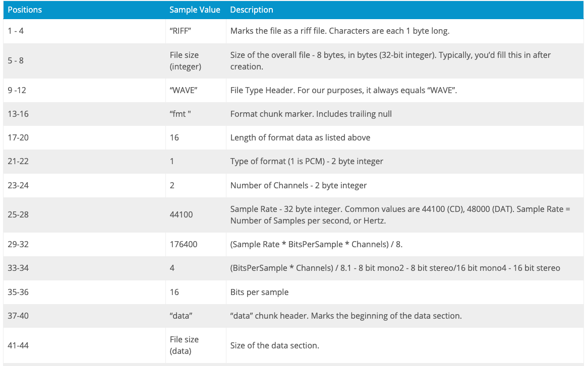
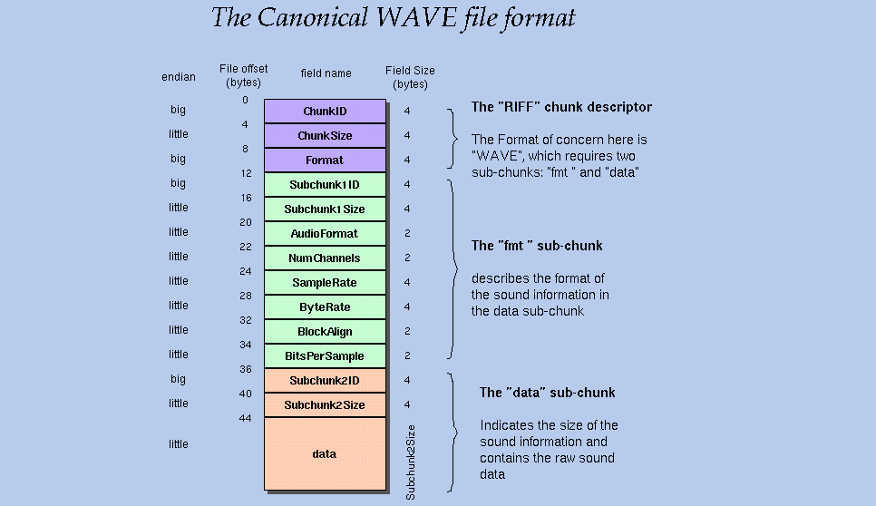

## Colab 錄音
[](https://colab.research.google.com/github/1010code/onnxruntime-wav2vec/blob/main/example-audio-read/colab_audio_record.ipynb)


## Compile

```
g++ main.cpp read_audio.cpp -o main -std=c++17
./main
```

輸出結果：
```
-----------------------------------------------------
 Size of Header: 44 bytes
 Sampling rate: 16000 Hz
 File size: 186276 bytes --> 實際檔案總大小(ChunkSize)
 Audio data size: 186240 bytes --> 音訊資料佔據的記憶體大小 samples*2
 Number of frames: 5820 --> 音訊長度(可以當成單位是ms代表約六秒音訊)
 Number of samples: 93120 --> 音檔所有的音訊數量(Subchunk2Size)
-----------------------------------------------------
Samples: 93120
mean: -1.08013 variance: 3.37448e+06
First sample: 4.36223e-05
```

## WAV File Header





- ChunkSize (實際檔案大小)
    - 36 + SubChunk2Size, or more precisely:
      4 + (8 + SubChunk1Size) + (8 + SubChunk2Size)
- BitsPerSample
    - 16 bits.
- Subchunk2Size (總samples空間大小bytes)
    - NumSamples * NumChannels * BitsPerSample/8
      This is the number of bytes in the data.
      You can also think of this as the size
      of the read of the subchunk following this number.
    - 因為是 short int(16 bit = 2bytes)，所以單聲道的音訊資料大小為 NumSamples*2 個 bytes

## Reference
- [WAV File Header](https://docs.fileformat.com/audio/wav/)
- [WAV Header Synopsis](https://isip.piconepress.com/projects/speech/software/tutorials/production/fundamentals/v1.0/section_02/s02_01_p05.html)
- [Reading the header of a wav file](https://onestepcode.com/read-wav-header/)
- [WaveFormat]()